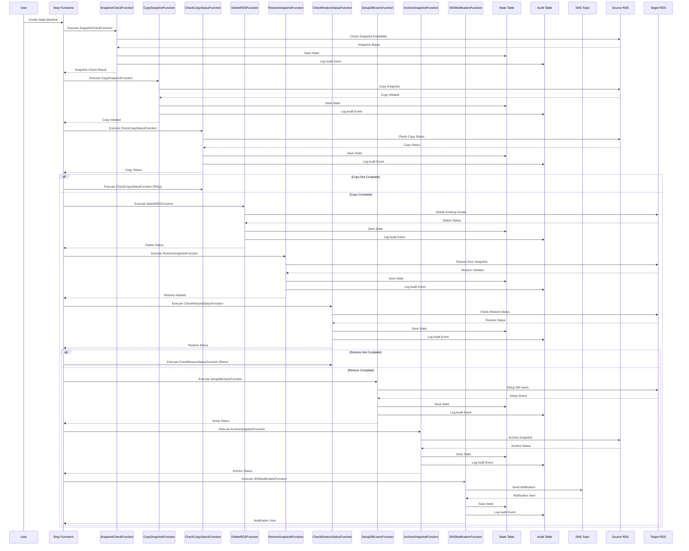

# Aurora Restore Pipeline Data Flow

## Diagram Description

This sequence diagram illustrates the data flow of the Aurora Restore Pipeline, showing the interactions between different components:

1. **User**: Initiates the restore process by invoking the Step Functions state machine.
2. **Step Functions**: Orchestrates the entire restore process, coordinating the execution of Lambda functions.
3. **Lambda Functions**: Execute individual steps of the restore process.
4. **DynamoDB Tables**: Store state and audit information.
5. **SNS Topic**: Sends notifications about the restore process.
6. **RDS**: Contains the source and target Aurora clusters.

The diagram shows the flow of data and control between components, including:
- Checking the availability of the source snapshot
- Copying the snapshot from the source region to the target region
- Checking the status of the snapshot copy operation
- Deleting an existing RDS cluster in the target region (if needed)
- Restoring the Aurora cluster from the snapshot
- Checking the status of the restore operation
- Setting up database users and permissions
- Archiving the snapshot after successful restore
- Sending notifications about the completion of the restore operation

The diagram also shows the retry logic for the snapshot copy and restore operations. 