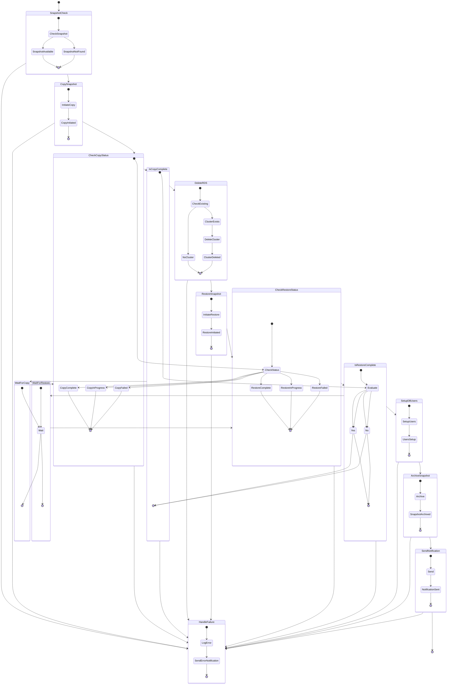

# Aurora Restore Pipeline State Machine

## Diagram Description

This state diagram illustrates the Step Functions state machine of the Aurora Restore Pipeline, showing the states and transitions:

1. **SnapshotCheck**: Validates the source snapshot and checks its availability.
2. **CopySnapshot**: Copies the snapshot from the source region to the target region.
3. **CheckCopyStatus**: Checks the status of the snapshot copy operation.
4. **IsCopyComplete**: Determines if the snapshot copy is complete.
5. **WaitForCopy**: Waits for a specified period before checking the copy status again.
6. **DeleteRDS**: Deletes an existing RDS cluster in the target region (if needed).
7. **RestoreSnapshot**: Restores the Aurora cluster from the snapshot.
8. **CheckRestoreStatus**: Checks the status of the restore operation.
9. **IsRestoreComplete**: Determines if the restore operation is complete.
10. **WaitForRestore**: Waits for a specified period before checking the restore status again.
11. **SetupDBUsers**: Sets up database users and permissions.
12. **ArchiveSnapshot**: Archives the snapshot after successful restore.
13. **SendNotification**: Sends a notification about the completion of the restore operation.
14. **HandleFailure**: Handles failures in the restore process.

The diagram shows the flow of control between states, including:
- The main flow of the restore process
- The retry logic for the snapshot copy and restore operations
- The error handling paths

Each state has its own sub-states, showing the internal logic of the state. 