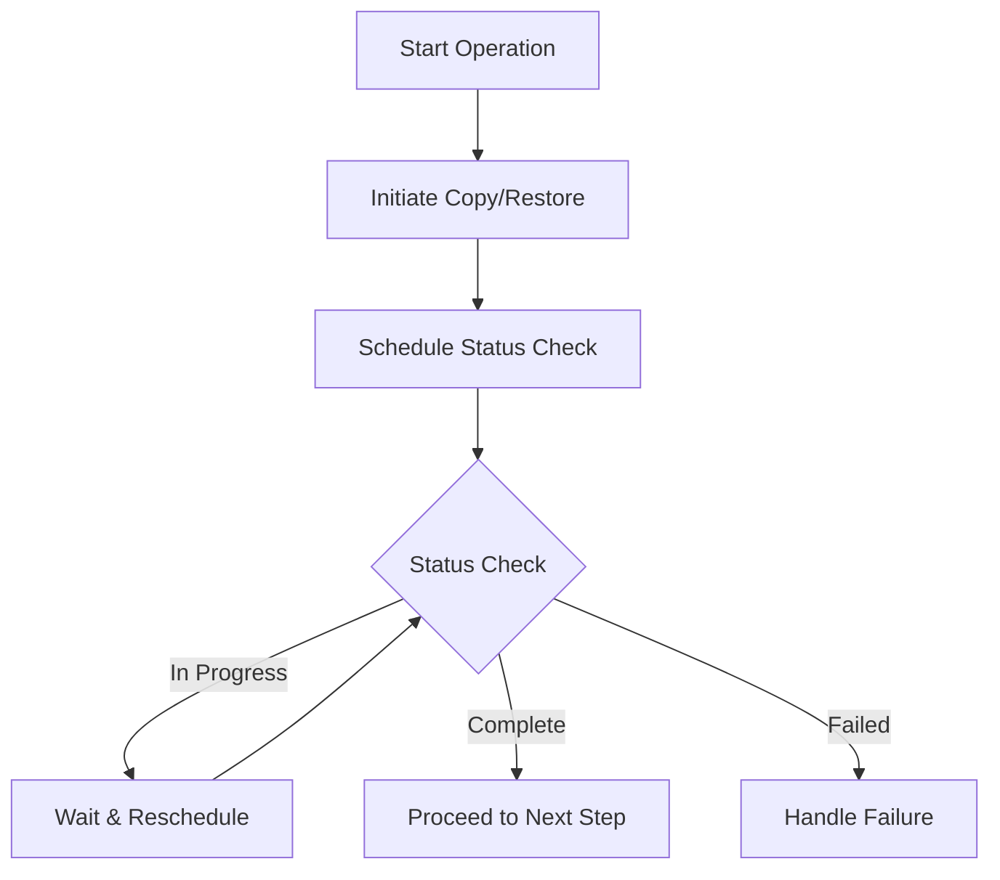

# Aurora Restore Pipeline - Long-Running Operations Guide

## Handling Large Snapshot Operations (9TB+)

For large snapshots (9TB+), copy and restore operations can take several hours to complete. This guide outlines how to implement robust status checking for these long-running operations.

## 1. Status Checking Architecture

### A. Event-Driven Approach



### B. Implementation Options

1. **EventBridge Scheduled Rules**:
   - Create a rule that triggers the status check function at regular intervals
   - Adjust the interval based on snapshot size
   - Example: Check every 15 minutes for a 9TB snapshot

2. **Step Functions with Wait States**:
   - Use Step Functions to orchestrate the workflow
   - Implement wait states between status checks
   - Configure maximum execution time (up to 1 year)

3. **Lambda with Self-Invocation**:
   - Lambda function schedules itself to run again after a wait period
   - Passes state through environment variables or DynamoDB
   - Implements exponential backoff for retries

## 2. Status Check Implementation

### A. Copy Snapshot Status Check

```python
def check_copy_status(operation_id, copy_snapshot_id, max_attempts=100, initial_interval=900):
    """
    Check the status of a snapshot copy operation with exponential backoff.
    
    Args:
        operation_id: The unique identifier for this restore operation
        copy_snapshot_id: The ID of the snapshot being copied
        max_attempts: Maximum number of status check attempts
        initial_interval: Initial wait time in seconds (default: 15 minutes)
    """
    # Load current state
    state = load_state(operation_id)
    attempt = state.get('status_check_attempt', 0) + 1
    
    # Check snapshot status
    try:
        response = rds_client.describe_db_cluster_snapshots(
            DBClusterSnapshotIdentifier=copy_snapshot_id
        )
        
        if not response['DBClusterSnapshots']:
            raise Exception(f"Snapshot {copy_snapshot_id} not found")
            
        snapshot = response['DBClusterSnapshots'][0]
        status = snapshot['Status']
        
        # Update state with current status
        state['copy_status'] = status
        state['status_check_attempt'] = attempt
        state['last_check_time'] = datetime.now().isoformat()
        
        if status == 'available':
            # Copy complete, proceed to next step
            state['status'] = 'SUCCESS'
            save_state(state)
            trigger_next_step(operation_id, 'delete-rds')
            return
            
        elif status == 'failed':
            # Copy failed, handle error
            state['status'] = 'FAILED'
            state['error'] = f"Snapshot copy failed: {snapshot.get('StatusMessage', 'Unknown error')}"
            save_state(state)
            handle_failure(operation_id, 'copy-snapshot', state['error'])
            return
            
        elif status == 'creating' and attempt < max_attempts:
            # Still in progress, schedule next check with exponential backoff
            wait_time = min(initial_interval * (2 ** (attempt - 1)), 3600)  # Cap at 1 hour
            schedule_next_check(operation_id, 'check-copy-status', wait_time)
            save_state(state)
            return
            
        else:
            # Max attempts reached or unknown status
            state['status'] = 'FAILED'
            state['error'] = f"Max attempts reached or unknown status: {status}"
            save_state(state)
            handle_failure(operation_id, 'check-copy-status', state['error'])
            return
            
    except Exception as e:
        # Handle exceptions
        state['status'] = 'FAILED'
        state['error'] = str(e)
        save_state(state)
        handle_failure(operation_id, 'check-copy-status', str(e))
```

### B. Restore Status Check

```python
def check_restore_status(operation_id, cluster_id, max_attempts=100, initial_interval=900):
    """
    Check the status of a cluster restore operation with exponential backoff.
    
    Args:
        operation_id: The unique identifier for this restore operation
        cluster_id: The ID of the cluster being restored
        max_attempts: Maximum number of status check attempts
        initial_interval: Initial wait time in seconds (default: 15 minutes)
    """
    # Load current state
    state = load_state(operation_id)
    attempt = state.get('status_check_attempt', 0) + 1
    
    # Check cluster status
    try:
        response = rds_client.describe_db_clusters(
            DBClusterIdentifier=cluster_id
        )
        
        if not response['DBClusters']:
            raise Exception(f"Cluster {cluster_id} not found")
            
        cluster = response['DBClusters'][0]
        status = cluster['Status']
        
        # Update state with current status
        state['restore_status'] = status
        state['status_check_attempt'] = attempt
        state['last_check_time'] = datetime.now().isoformat()
        
        if status == 'available':
            # Restore complete, proceed to next step
            state['status'] = 'SUCCESS'
            state['cluster_endpoint'] = cluster['Endpoint']
            state['cluster_port'] = cluster['Port']
            save_state(state)
            trigger_next_step(operation_id, 'setup-db-users')
            return
            
        elif status == 'failed':
            # Restore failed, handle error
            state['status'] = 'FAILED'
            state['error'] = f"Cluster restore failed: {cluster.get('StatusMessage', 'Unknown error')}"
            save_state(state)
            handle_failure(operation_id, 'restore-snapshot', state['error'])
            return
            
        elif status in ['creating', 'backing-up', 'modifying'] and attempt < max_attempts:
            # Still in progress, schedule next check with exponential backoff
            wait_time = min(initial_interval * (2 ** (attempt - 1)), 3600)  # Cap at 1 hour
            schedule_next_check(operation_id, 'check-restore-status', wait_time)
            save_state(state)
            return
            
        else:
            # Max attempts reached or unknown status
            state['status'] = 'FAILED'
            state['error'] = f"Max attempts reached or unknown status: {status}"
            save_state(state)
            handle_failure(operation_id, 'check-restore-status', state['error'])
            return
            
    except Exception as e:
        # Handle exceptions
        state['status'] = 'FAILED'
        state['error'] = str(e)
        save_state(state)
        handle_failure(operation_id, 'check-restore-status', str(e))
```

## 3. Scheduling Next Check

### A. Using EventBridge

```python
def schedule_next_check(operation_id, step, wait_time_seconds):
    """
    Schedule the next status check using EventBridge.
    
    Args:
        operation_id: The unique identifier for this restore operation
        step: The step to check (check-copy-status or check-restore-status)
        wait_time_seconds: Time to wait before next check
    """
    # Calculate next run time
    next_run_time = datetime.now() + timedelta(seconds=wait_time_seconds)
    
    # Create a unique rule name
    rule_name = f"status-check-{operation_id}-{step}-{int(time.time())}"
    
    # Create the rule
    eventbridge_client.put_rule(
        Name=rule_name,
        ScheduleExpression=f"rate({wait_time_seconds} seconds)",
        State='ENABLED',
        Description=f"Status check for {step} in operation {operation_id}"
    )
    
    # Add target (Lambda function)
    eventbridge_client.put_targets(
        Rule=rule_name,
        Targets=[
            {
                'Id': f"{operation_id}-{step}",
                'Arn': LAMBDA_FUNCTION_ARN,
                'Input': json.dumps({
                    'operation_id': operation_id,
                    'step': step
                })
            }
        ]
    )
    
    # Set rule to expire after execution
    eventbridge_client.put_rule(
        Name=rule_name,
        State='DISABLED',
        Description=f"Status check for {step} in operation {operation_id} (completed)"
    )
```

### B. Using Step Functions

```json
{
  "Comment": "Aurora Restore Pipeline with long-running operations",
  "StartAt": "SnapshotCheck",
  "States": {
    "SnapshotCheck": {
      "Type": "Task",
      "Resource": "arn:aws:lambda:region:account:function:aurora-restore-snapshot-check",
      "Next": "CopySnapshot"
    },
    "CopySnapshot": {
      "Type": "Task",
      "Resource": "arn:aws:lambda:region:account:function:aurora-restore-copy-snapshot",
      "Next": "CheckCopyStatus"
    },
    "CheckCopyStatus": {
      "Type": "Task",
      "Resource": "arn:aws:lambda:region:account:function:aurora-restore-check-copy-status",
      "Next": "IsCopyComplete"
    },
    "IsCopyComplete": {
      "Type": "Choice",
      "Choices": [
        {
          "Variable": "$.copy_status",
          "StringEquals": "available",
          "Next": "DeleteRDS"
        }
      ],
      "Default": "WaitForCopy"
    },
    "WaitForCopy": {
      "Type": "Wait",
      "Seconds": 900,
      "Next": "CheckCopyStatus"
    },
    "DeleteRDS": {
      "Type": "Task",
      "Resource": "arn:aws:lambda:region:account:function:aurora-restore-delete-rds",
      "Next": "RestoreSnapshot"
    },
    "RestoreSnapshot": {
      "Type": "Task",
      "Resource": "arn:aws:lambda:region:account:function:aurora-restore-restore-snapshot",
      "Next": "CheckRestoreStatus"
    },
    "CheckRestoreStatus": {
      "Type": "Task",
      "Resource": "arn:aws:lambda:region:account:function:aurora-restore-check-restore-status",
      "Next": "IsRestoreComplete"
    },
    "IsRestoreComplete": {
      "Type": "Choice",
      "Choices": [
        {
          "Variable": "$.restore_status",
          "StringEquals": "available",
          "Next": "SetupDBUsers"
        }
      ],
      "Default": "WaitForRestore"
    },
    "WaitForRestore": {
      "Type": "Wait",
      "Seconds": 900,
      "Next": "CheckRestoreStatus"
    },
    "SetupDBUsers": {
      "Type": "Task",
      "Resource": "arn:aws:lambda:region:account:function:aurora-restore-setup-db-users",
      "Next": "ArchiveSnapshot"
    },
    "ArchiveSnapshot": {
      "Type": "Task",
      "Resource": "arn:aws:lambda:region:account:function:aurora-restore-archive-snapshot",
      "Next": "SNSNotification"
    },
    "SNSNotification": {
      "Type": "Task",
      "Resource": "arn:aws:lambda:region:account:function:aurora-restore-sns-notification",
      "End": true
    }
  }
}
```

## 4. Monitoring Long-Running Operations

### A. CloudWatch Metrics

```python
def update_metrics(operation_id, step, status, duration_seconds=None):
    """
    Update CloudWatch metrics for monitoring long-running operations.
    
    Args:
        operation_id: The unique identifier for this restore operation
        step: The current step
        status: The current status
        duration_seconds: Duration of the operation in seconds (if available)
    """
    cloudwatch = boto3.client('cloudwatch')
    
    # Update status metric
    cloudwatch.put_metric_data(
        Namespace='AuroraRestore',
        MetricData=[
            {
                'MetricName': f'{step}_status',
                'Value': 1 if status == 'SUCCESS' else 0,
                'Unit': 'Count',
                'Dimensions': [
                    {'Name': 'OperationId', 'Value': operation_id},
                    {'Name': 'Step', 'Value': step}
                ]
            }
        ]
    )
    
    # Update duration metric if available
    if duration_seconds:
        cloudwatch.put_metric_data(
            Namespace='AuroraRestore',
            MetricData=[
                {
                    'MetricName': f'{step}_duration',
                    'Value': duration_seconds,
                    'Unit': 'Seconds',
                    'Dimensions': [
                        {'Name': 'OperationId', 'Value': operation_id},
                        {'Name': 'Step', 'Value': step}
                    ]
                }
            ]
        )
```

### B. CloudWatch Alarms

```json
{
  "AlarmName": "AuroraRestore-CopySnapshot-Timeout",
  "AlarmDescription": "Alarm when copy snapshot operation takes too long",
  "MetricName": "copy_snapshot_duration",
  "Namespace": "AuroraRestore",
  "Statistic": "Maximum",
  "Period": 3600,
  "EvaluationPeriods": 1,
  "Threshold": 86400,
  "ComparisonOperator": "GreaterThanThreshold",
  "AlarmActions": ["arn:aws:sns:region:account:aurora-restore-alerts"]
}
```

## 5. Best Practices for Large Snapshot Operations

1. **Adaptive Check Intervals**:
   - Start with frequent checks (every 15 minutes)
   - Gradually increase interval as operation progresses
   - Cap maximum interval at 1 hour

2. **Progress Tracking**:
   - For copy operations: Track bytes copied vs. total size
   - For restore operations: Track cluster status changes
   - Store progress in DynamoDB for resumption

3. **Timeout Handling**:
   - Set appropriate timeouts based on snapshot size
   - 9TB snapshot might take 24+ hours to copy/restore
   - Configure Step Functions with extended execution time

4. **Resource Management**:
   - Monitor AWS API throttling
   - Implement backoff strategies
   - Consider using AWS SDK's built-in retry mechanisms

5. **User Communication**:
   - Provide estimated completion time
   - Send progress notifications
   - Allow users to check status via API/console

## 6. Implementation Considerations

1. **Lambda Timeout**:
   - Lambda functions have a maximum timeout of 15 minutes
   - Use Step Functions or EventBridge for long-running operations
   - Don't rely on Lambda for continuous status checking

2. **Cost Optimization**:
   - Balance check frequency with cost
   - Use CloudWatch metrics to optimize check intervals
   - Consider using Step Functions for cost-effective orchestration

3. **Resilience**:
   - Implement idempotent operations
   - Handle AWS service disruptions
   - Maintain state in DynamoDB for recovery

4. **Security**:
   - Ensure proper IAM permissions
   - Encrypt sensitive data
   - Implement least privilege access 